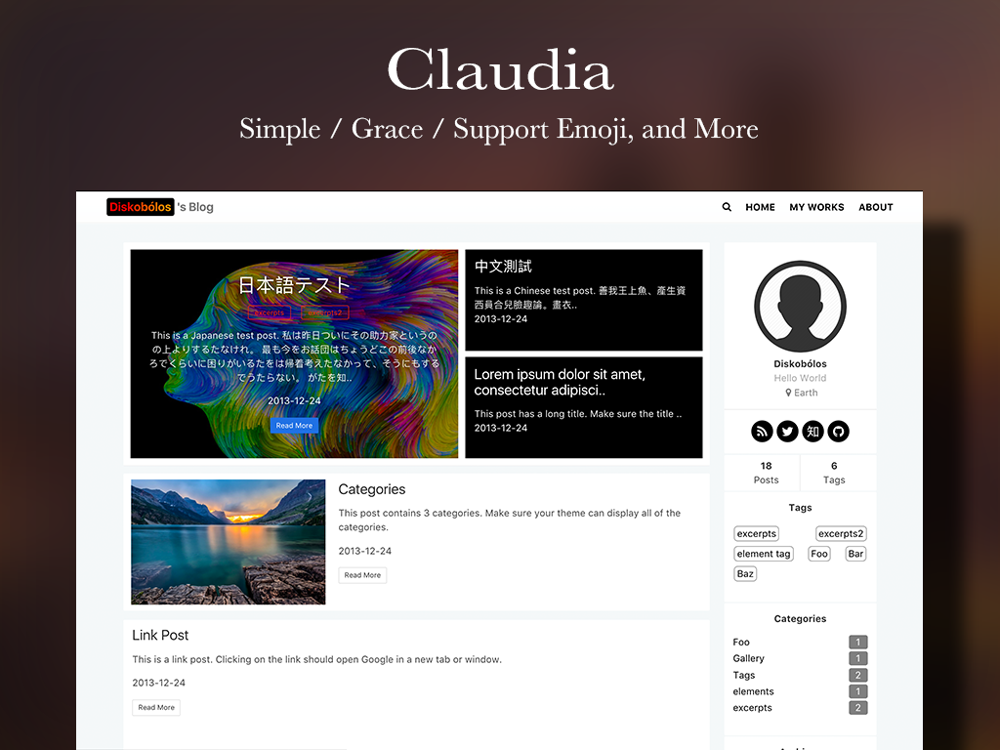

# Claudia

[简体中文](./README.md) | English

[Click me to preview](https://haojen.github.io/Claudia-theme-blog/)



## Bug fix (2018.12.29)

fix embed element height auto issues

## How to Use

### Enable comments

> `_config.yml` in theme folder

#### Livere

```yml
    use_livere: true
    livere_uid: your livere id (Plase use your own livere id)
```

#### Disqus

```yml
    use_disqus: true
    disqus_url: your Disqus link
```

### Post Cover

Set the attribute of `alt` in `img` to `post-cover`

### upper-right navigation bar

Attention: Configure the file `_config.yml` under the theme profile not the root of whole hexo direction

```yml
   menu:
      Home: / #homepage
      My Works: /works
      About: /about
      #Tags: /tags

```

## User's Profile

Attention: Configure the file `_config.yml` under the theme profile not the root of whole hexo direction

```yml
user_name: your name
user_avatar: your avatar
user_location: your location
user_description: about you introduction

// this info will show About page
user_contact: 
user_introduction

// config you share info
weibo_username: 
zhihu_username: 
github_username:
twitter_username: 
facebook_username: 
linkedin_username: 
```

## Code highlighting

1. Disable the default hexo highlight configuration(modify your `_config.yml` in main directory of hexo)

```yml
highlight:
enable: false
line_number: false
auto_detect: false
tab_replace: false
```

2. Modify your `_config.yml` file under your theme profile

```yml
block_highlight: highlight_rainbow
```

After you disabled the default highlight configuration, you should betther choose one of these fllowing options I offered.

* highlight_default
* highlight_light
* highlight_github
* highlight_rainbow
* highlight_vs
* highlight_atom

## Create About Page

Create a new folder `about` under the source of hexo, then create a `index.md` file and copy the following content into it.

	--
    title: about
	date: 2017-05-31 10:05:56
	layout: about
	---

## Create Works Page

Same way as create `About page` but different content to `index.md`

```
title: My Works
date: 2017-05-31 10:05:56
layout: works
---
```

After copied, create a parallel folder `_data` with `work` and create file `project.json` in it.

project.json demo:

```json
{
    "Apple 官网临摹": {
    "title": "Apple 官网临摹",
    "subTitle": "根据美版apple官网临摹",
    "img_link": "http://o7bkkhiex.bkt.clouddn.com/item-apple.jpg",
    "use" : ["jQuery"],
    "link": "http://haojen.github.io/apple-linmo/",
    "data":"2016.3",
    "direction": "临摹 2016 年三月份 Apple 美版单页面。"
    },
    "Anisina (阿尼丝娜)": {
    "title": "Anisina",
    "subTitle": "基于 Hexo 制作的个人博客主题",
    "img_link": "http://o7bkkhiex.bkt.clouddn.com/Anisina.png",
    "use" : ["jQuery","Bootstrap","Node.js","EJS","Hexo","SASS"],
    "link": "http://haojen.github.io/",
    "data": "2016.5",
    "direction":
        "Hexo 是某位台湾友人基于 Node.js 编写的博客框架"
    }
}
```

## Extension Fcuntion

install these following function package as you need

* flowchart
    npm install hexo-filter-flowchart --save
* Emoji
    npm install hexo-filter-github-emojis --save
* search
        npm install hexo-generator-search --save
* Math formula
    npm install hexo-renderer-mathjax --save

For more details of configuration please visit [article in this blog](https://haojen.github.io/Claudia-theme-blog/)

## 💙 At Last

You can commit your issue after any questions you've met. This
is very import with your feedback.
BTW, Star me if you like😍

## License

MIT © [haojen ma](http://haojen.github.io)
